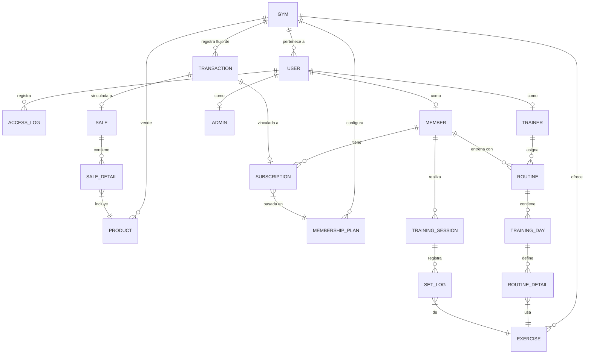

# TrainingApp - Sistema de Gestión de Entrenamientos

**[Live Demo: Probar la aplicación aquí](https://training-app-blush.vercel.app/login)** | **[Video Demostrativo del flujo completo](https://youtu.be/IpZ2qBtyMIQ)**

### Accesos Rápidos (Demo)
Puedes explorar los distintos flujos y niveles de autorización (RBAC) utilizando las siguientes credenciales:

| Rol | Email | Contraseña |
| :--- | :--- | :--- |
| 👑 **Dueño de Gimnasio** | gerente@trainingapp.com | password123 |
| 🏋️ **Profesor** | entrenador@trainingapp.com | 33333333 |
| 👤 **Miembro** | miembro@trainingapp.com | 77777777 |
| 🧑‍💼 **Recepcionista** | recepcion@trainingapp.com | 44444444 |

# Sobre el proyecto

**TrainingApp** es una robusta API REST diseñada para la gestión integral de gimnasios, rutinas personalizadas y seguimiento de progreso. Este proyecto fue desarrollado como parte de un portafolio para demostrar habilidades avanzadas en el ecosistema **Java/Spring** y la aplicación de principios de ingeniería de software.

---

## Características Principales

*   **Gestión Multi-Gimnasio:** Soporte para múltiples sucursales con aislamiento de datos.
*   **Sistema de Rutinas Dinámicas:** Creación de rutinas por entrenadores o usuarios, con días de entrenamiento y ejercicios específicos.
*   **Tracker de Entrenamiento:** Registro de series, repeticiones, peso y cálculo automático de **e1RM (1RM estimado)** para medir el progreso.
*   **Control de Acceso (QR):** Generación y validación de tokens QR para el ingreso al gimnasio.
*   **Gestión de Membresías:** Control de suscripciones activas/vencidas y procesamiento de transacciones.
*   **Dashboard Inteligente:** Métricas personalizadas para Administradores, Entrenadores y Miembros.

---

## Arquitectura y Patrones

El proyecto destaca por el uso de **Arquitectura Hexagonal (Clean Architecture)** y principios de **DDD (Domain-Driven Design)**:

*   **Capa de Dominio:** Entidades ricas en lógica de negocio (no anémicas), objetos de valor y reglas de validación intrínsecas.
*   **Capa de Aplicación:** Implementación de Casos de Uso independientes de la infraestructura.
*   **Capa de Infraestructura:** Desacoplamiento total de la base de datos (JPA/MySQL) y seguridad (JWT).
* **Principios SOLID:** Código altamente mantenible, testeable y escalable.

---

## 📊 Modelo de Datos / DER

A continuación, se presenta el modelo relacional simplificado de la aplicación, mostrando cómo interactúan los diferentes módulos (Gimnasios, Usuarios, Rutinas, Tracker y Finanzas):



---

## 🛠️ Stack Tecnológico

*   **Lenguaje:** Java 21
*   **Framework:** Spring Boot 3.4.1
*   **Persistencia:** Spring Data JPA / MySQL
*   **Seguridad:** Spring Security + JWT (JSON Web Tokens)
*   **Validación:** Hibernate Validator / Jakarta Validation
*   **Testing:** JUnit 5, Mockito, AssertJ, Testcontainers
*   **Herramientas:** Maven, Lombok

---

## Calidad y Testing

Se ha priorizado la fiabilidad del sistema mediante una estrategia de pruebas exhaustiva:
*   **Unit Tests:** Pruebas de lógica de dominio y casos de uso.
*   **Integration Tests:** Validación de repositorios y controladores.
*   **E2E Tests:** Pruebas de flujo de negocio completo (Login -> Crear Rutina -> Registrar Entrenamiento).

---

## Configuración y Despliegue Local

### Requisitos Previos
* **Java:** JDK 21 o superior.
* **Node.js:** v18 o superior y administrador de paquetes npm.
* **Base de Datos:** MySQL 8.0+.
* **Herramientas:** Maven 3.8+ y Git.

### 1. Clonar el repositorio
```bash
git clone https://github.com/jeronimopizarro/TrainingApp.git
cd TrainingApp
```

### 2. Configuración del Backend (Spring Boot)
1. Crea una base de datos en MySQL (ej. `trainingapp_db`).
2. Configura tus credenciales de acceso en el archivo:  
   `src/main/resources/application.properties`
   
   ```properties
   spring.datasource.url=jdbc:mysql://localhost:3306/tu_base_de_datos
   spring.datasource.username=tu_usuario
   spring.datasource.password=tu_contraseña
   ```

3. Compila y ejecuta el servidor:
   ```bash
   mvn clean install
   mvn spring-boot:run
   ```
   > **API REST disponible en:** `http://localhost:8080`

### 3. Configuración del Frontend (React + Vite)
Abre una **nueva terminal** en la raíz del proyecto y ejecuta:

1. Navega a la carpeta del cliente:
   ```bash
   cd frontend
   ```

2. Instala las dependencias:
   ```bash
   npm install
   ```

3. Inicia el entorno de desarrollo:
   ```bash
   npm run dev
   ```
   > **Interfaz de usuario disponible en:** `http://localhost:5173`

---
